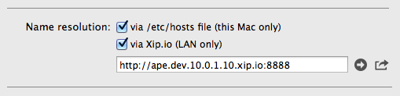

MAMP
============

###Accessing MAMP sites on other machines

When developing on MAMP, you can do cross device testing by ticking the option
to resolve via xip.io. This will generate a URL for you which will work on any device as long
as it is connected to the local area network.



One thing to bear in mind is that if you're developing a Wordpress site, Wordpress keeps a record 
of the site address to return absolute URLS in functions such as
`get_stylesheet_directory_uri()`.

This is first set when the site is being installed, so, in the image above, it would be `http://ape.dev`. 
This being the case, the stylesheet link would not work on the `http://ape.dev.10.0.1.10.xip.io:8888` address.

To get around this, you can set the site name dynamically, depending on the host name, by including a conditional
like this in your `wp-config.php` file

```
if ($_SERVER['HTTP_HOST'] == 'ape.dev:8888'){
	define('WP_HOME','http://ape.dev:8888');
	define('WP_SITEURL','http://ape.dev:8888');
} elseif($_SERVER['HTTP_HOST'] == 'ape.dev.10.0.1.10.xip.io:8888') {
	define('WP_HOME','http://ape.dev.10.0.1.10.xip.io:8888');
	define('WP_SITEURL','http://ape.dev.10.0.1.10.xip.io:8888');
}
```